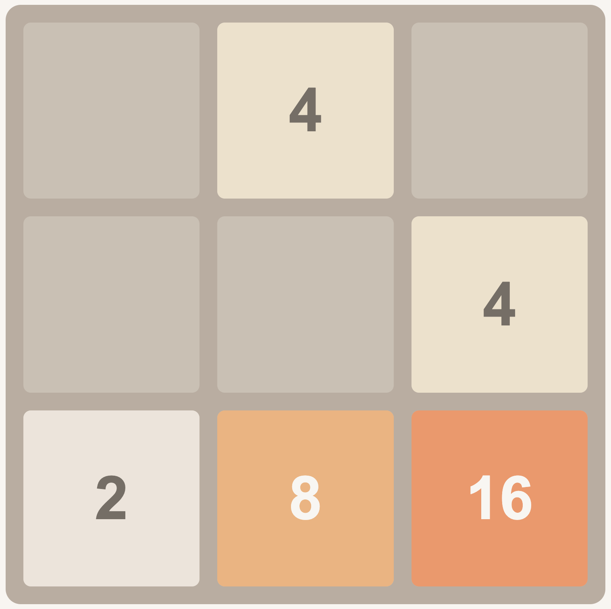

<!-- PROJECT LOGO -->
 

  

<h3 align="center">2048</h3>

  

    Clone of 2048 game
     
    <a href="https://github.com/Riki9811/2048"><strong>Explore the docs »</strong></a>
     
     
    <a href="https://github.com/Riki9811/2048">View Demo</a>
    ·
    <a href="https://github.com/Riki9811/2048/issues">Report Bug</a>
    ·
    <a href="https://github.com/Riki9811/2048/issues">Request Feature</a>
  

<!-- TABLE OF CONTENTS -->

  
Table of Contents

  <ol>
    <li>
      <a href="#about-the-project">About The Project</a>
    </li>
    <li><a href="#roadmap">Roadmap</a></li>
    <li><a href="#contact">Contact</a></li>
  </ol>

 

<!-- ABOUT THE PROJECT -->

## About The Project

[![2048 Screen Shot][product-screenshot]](https://example.com)

This project is a clone of the original 2048 game. Written in plain Javascript. The game will have some extra features like custom game-board dimensions, saving scores and statistics in localStorage and some additional graphical settings like dark/light mode.

(<a href="#top">back to top</a>)

<!-- ROADMAP -->

## Roadmap

-   [x] Main game functionallity
-   [x] UI elements
-   [ ] Info menu on how to play
-   [ ] Saving statistics in local storage
-   [ ] Statistics menu
-   [ ] Swipe controls for mobile
-   [ ] Settings menu

See the [open issues](https://github.com/Riki9811/2048/issues) for a full list of proposed features (and known issues).

(<a href="#top">back to top</a>)

<!-- CONTACT -->

## Contact

Riccardo Mariotti - riccardo.mariotti98@gmail.com

Project Link: [https://github.com/Riki9811/2048](https://github.com/Riki9811/2048)

(<a href="#top">back to top</a>)

[product-screenshot]: images/screenshot.png
