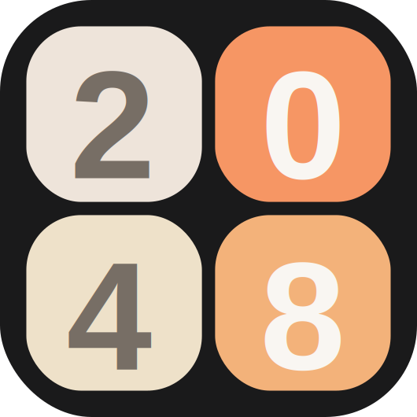

<!-- PROJECT LOGO -->
 

  

<h3 align="center">2048</h3>

  

    Clone of 2048 game
     
    <a href="https://github.com/Riki9811/2048"><strong>Explore the docs »</strong></a>
     
     
    <a href="https://github.com/Riki9811/2048">View Demo</a>
    ·
    <a href="https://github.com/Riki9811/2048/issues">Report Bug</a>
    ·
    <a href="https://github.com/Riki9811/2048/issues">Request Feature</a>
  

<!-- TABLE OF CONTENTS -->

  
Table of Contents

  <ol>
    <li>
      <a href="#about-the-project">About The Project</a>
    </li>
    <li><a href="#how-to-play">How To Play</a></li>
    <li><a href="#roadmap">Roadmap</a></li>
    <li><a href="#contact">Contact</a></li>
  </ol>

 

<!-- ABOUT THE PROJECT -->

## About The Project

[![2048 Screen Shot][product-screenshot]](https://example.com)

This project is a clone of the original 2048 game. Written in plain Javascript. The game will have some extra features like custom game-board dimensions, saving scores and statistics in localStorage and some additional graphical settings like dark/light mode.

(<a href="#top">back to top</a>)

<!-- HOW TO PLAY -->

## How To Play

For everyone living under a rock, this is how to play tha game:

The aim of the game is to combine tiles with the same value.
Pressing the arrow keys (or swiping on mobile) will move all tiles in the direction of the key pressed/swipe. After all the tiles are done moving a new tile with a value of 2 or 4 will be created in a random empty cell. Two tiles with the same number will merge when they collide to create a single tile with double the value.
The game is over when there are no valid ways for you to move the tiles.

(<a href="#top">back to top</a>)

<!-- ROADMAP -->

## Roadmap

-   [x] Main game functionallity
-   [x] UI elements
-   [x] Info menu on how to play
-   [x] Dark/light mode toggling
-   [x] Saving statistics in local storage
-   [x] Statistics menu
-   [x] Hamburger-menu select prebuilt game sizes
-   [x] Hamburger-menu select custom size
-   [x] Score increase animation
-   [ ] Swipe controls for mobile

See the [open issues](https://github.com/Riki9811/2048/issues) for a full list of proposed features (and known issues).

(<a href="#top">back to top</a>)

<!-- CONTACT -->

## Contact

Riccardo Mariotti - riccardo.mariotti98@gmail.com

Project Link: [https://github.com/Riki9811/2048](https://github.com/Riki9811/2048)

(<a href="#top">back to top</a>)

[product-screenshot]: logos/screenshot.png
